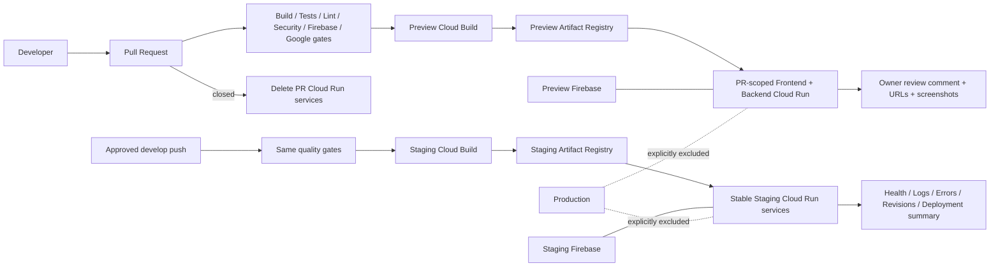

# Preview and Staging Architecture

## Recommendation

Use Cloud Run for the existing standalone Next.js frontend and NestJS backend, Cloud Build for immutable container builds, Artifact Registry for images, separate Firebase projects for client services, GitHub Actions with Workload Identity Federation for orchestration, and Secret Manager for environment-specific build configuration. This matches the current containers and Google foundation without introducing another platform.

## Architecture diagram

## Environment boundaries

| Environment | Google/Firebase identity | Data | Deployment |
|---|---|---|---|
| Development | Developer-only projects/emulators | Synthetic/local | Manual local |
| Preview | Dedicated Preview projects | Ephemeral test data | Every eligible PR, PR-scoped services |
| Staging | Dedicated Staging projects | Stable test fixtures | Approved `develop` branch only |
| Production | Existing production projects | Production data | Not touched by this mission |

No mutable project, service account, secret, image repository, Cloud Run service, Firebase project, or data store is shared between these environments.

## Deployment flow

1. PR gates run build, all tests, lint/type checks, high-severity dependency audit, Firebase validation, Google validation, and secret-usage validation.
2. GitHub obtains a short-lived Preview identity through Workload Identity Federation.
3. Cloud Build builds the backend first; its Cloud Run revision binds the isolated Cloud SQL instance and DATABASE_URL secret. The deployment reads the actual backend URL, then builds the frontend with that API URL and environment-specific Firebase/Maps configuration from Secret Manager.
4. PR-numbered Cloud Run services deploy. The backend receives the exact frontend CORS origin; backend/frontend health checks and a credentialed-origin OPTIONS preflight gate deployment success.
5. CI captures Staging (before) and Preview (after) screenshots, uploads them, and posts/updates the owner review comment.
6. PR close deletes the PR services.
7. A push to `develop` repeats gates and deploys stable Staging services using only Staging identity/configuration.

## Preview strategy

A PR receives `khedmah-pr-<number>-frontend` and `khedmah-pr-<number>-backend`. Each synchronize event replaces traffic with images tagged `preview-pr-<number>-<SHA>`. Concurrency cancels obsolete runs. Preview uses no production data and cannot deploy when its project equals Production.

## Staging strategy

Staging uses stable service names and immutable SHA tags. The GitHub `staging` environment supplies isolated WIF/deployer/runtime identities and variables. Protect that environment with required reviewers. Only pushes to the approved `develop` branch can deploy.

## Monitoring

GitHub job/step summaries provide deployment status and URL history. Cloud Build records build history. Cloud Run health checks and exact credentialed-origin preflight checks gate success; revisions provide deployment history/rollback targets. Cloud Logging, Error Reporting, and Cloud Monitoring remain project-isolated. Firebase status is validated before deployment. Configure alert policies for failed health checks, 5xx rate, latency, instance saturation, build failure, and Firebase errors in the Preview/Staging projects.

## Rollback and release

For Preview, redeploy a prior commit or close/reopen the PR. For Staging, list ready backend/frontend revisions and run `scripts/deployment/rollback-staging.sh <backend-revision> <frontend-revision>`, then verify health/logs. A release candidate must be owner-approved in Preview, healthy in Staging, and follow the existing production certification process; this mission performs no production action.

## Required GitHub environment configuration

Create protected `preview` and `staging` GitHub environments. Configure their WIF provider, deployer/runtime service accounts, Google region, isolated project IDs, Artifact Registry names, all four environment identity variables for the separation gate, and `STAGING_FRONTEND_URL` for before screenshots. Configure `PREVIEW_CLOUD_SQL_INSTANCE_CONNECTION_NAME` and `STAGING_CLOUD_SQL_INSTANCE_CONNECTION_NAME` in their corresponding environments. Each connection must match its deployment project and region. Secret Manager in each Google project must hold only its own seven `NEXT_PUBLIC_FIREBASE_*` build values, Maps browser key and `DATABASE_URL`; the runtime identity needs access to the database secret and Cloud SQL. The frontend API URL is obtained from the deployed backend, not from a production fallback. Protected Staging deployment and a real before-screenshot baseline still require their configured environment and approved branch.
