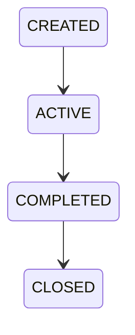
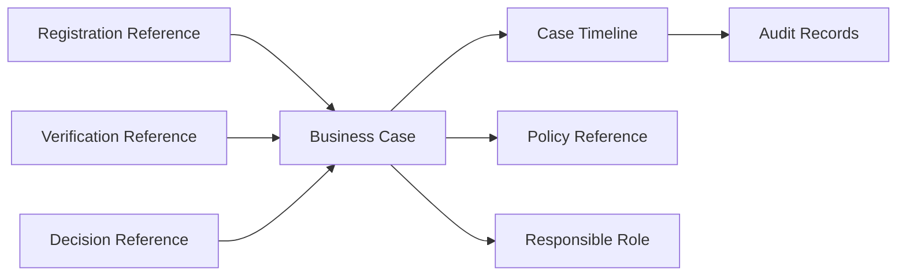

# OP-001D — Business Case Foundation

## Executive Summary

OP-001D establishes the Business Case as KDOS's immutable, traceable operational container. It connects the canonical registration, verification, decision, audit, and future analytics-readable timeline through one case identifier and correlation ID. The authorized implementation stops after decision association and audit-timeline update.

## Business Case Model

The model contains `caseIdentifier`, `caseType`, monotonic `version`, one of the four authorized lifecycle states, responsible role, governing policy reference, correlation ID, operation references, timestamps, major-event timeline, and audit-record associations. References are identifiers only; the case does not own or recreate OP-001A/B/C records.

## Operational Flow

```text
Business Case Created
        ↓
Registration Attached (OP-001A reference)
        ↓
Verification Attached (OP-001B reference)
        ↓
Decision Attached (OP-001C reference)
        ↓
Audit Timeline Updated — STOP
```

## Lifecycle Diagram



No other state or transition is authorized.

## Relationship Diagram



Every association must carry the same Business Case identifier, correlation ID, and governing policy reference. A decision must additionally identify the verification already attached to the case.

## Components Reused

- OP-001A registration output through its canonical reference.
- OP-001B verification output through its canonical reference.
- OP-001C decision output through its canonical reference.
- Policy Governance through the governing policy reference.
- Role Framework through the responsible-role identifier.
- Operational Compiler Kernel convention through the bounded orchestration input/output boundary.

No parallel operation, policy, role, audit, or compiler implementation is introduced.

## Components Introduced

- Business Case identity and immutable aggregate.
- The four-state lifecycle transition table.
- Ordered reference-association validation.
- Case event timeline and audit-record association.
- A case-scoped operational-flow function for contract and end-to-end verification.

## Audit Evidence

Creation, state changes, and each attached reference produce both a major timeline event and an associated audit record. Each record contains the case identifier, correlation ID, policy reference, event identifier, and recorded timestamp. Version increments make the event order reviewable.

## Test Results

Automated unit tests cover creation, immutability, invalid ownership/data, duplicates, circular references, lifecycle transitions, missing references, and invalid decision ordering. The integration/end-to-end test feeds OP-001A, OP-001B, and OP-001C-shaped canonical outputs into OP-001D and proves all events remain attached to one case and audit timeline. The repository test command is the authoritative result recorded in the delivery summary.

## Known Limitations

- Duplicate checking consumes the caller/compiler's known identifier set because persistence is forbidden.
- Related-case validation rejects direct self-reference; graph-wide cycle detection belongs at the compiler boundary where the complete case set is available.
- Operation records, policy definitions, roles, and audit records remain owned by their canonical components.
- Analytics may read the stable timeline contract in future authorized work; no analytics pipeline is implemented here.

## Remaining Work Before OP-001E

- Obtain OP-001E governance authorization and its explicit scope.
- Confirm canonical OP-001A/B/C output adapters retain these reference, case, correlation, and policy fields.
- Define any cross-case graph validation only if a later authorized mission requires it.
- Do not add approval, publication, business release, marketplace, payment, messaging, generic workflow/case engines, APIs, UI, persistence, or AI decisions.

