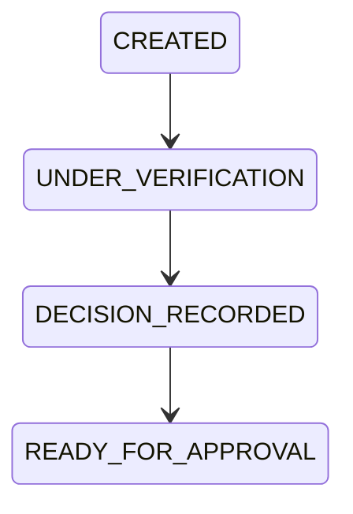

# OP-001E — Operational Status Foundation

## Executive Summary

OP-001E adds the governed current operational snapshot for an OP-001D Business Case. It keeps the immutable OP-001C Decision Object as permanent evidence and changes only the Operational Status snapshot through an append-only history. Execution terminates at `READY_FOR_APPROVAL`; approval is not implemented.

## Operational Status Model

The immutable snapshot contains `statusIdentifier`, monotonic `version`, `currentStatus`, Business Case reference, current Decision reference, governing policy reference, responsible role, correlation identifier, related status identifiers, and append-only transition history. Each history entry records previous and current status, timestamp, evidence reference, and audit references.

## Status Transition Diagram

`READY_FOR_APPROVAL` is the terminal OP-001E boundary. No `APPROVED` status exists.

## Relationship Diagram

## Validation Report

Validation rejects unknown or non-`CREATED` initial statuses, skipped/reversed transitions, duplicate identifiers supplied by the compiler boundary, missing Business Case, Decision, policy or role references, direct self/circular references, and transition evidence associated with a different case, Decision, or correlation identifier.

## Audit Evidence

Creation and every authorized transition append a frozen history entry containing sequence/version, previous and current status, transition timestamp, evidence reference, audit references, Business Case reference, Decision reference, and correlation identifier. Earlier snapshots and entries are never mutated.

## Test Results

Unit tests cover valid creation, invalid statuses and transitions, duplicates, all required references, circular references, association stability, and history immutability. Integration tests prove Business Case-to-Decision-to-Operational Status-to-Audit linkage. The end-to-end test composes OP-001A through OP-001E and proves termination at `READY_FOR_APPROVAL` without approval data or behavior.

## Components Reused

- OP-001A registration reference and OP-001B verification reference through OP-001D.
- OP-001C immutable Decision reference without modification or reimplementation.
- OP-001D Business Case identity, decision association, correlation identifier, and governed flow.
- Policy Governance and Role Definition references.
- Operational Compiler Kernel input conventions for known identifiers and canonical references.

No duplicate operation, Decision, Business Case, policy, role, audit, lifecycle, or compiler implementation is introduced.

## Components Introduced

- Operational Status identity and immutable current snapshot.
- The four authorized Operational Status values and their fixed transition rules.
- Append-only, audit-linked status history.
- A bounded pre-approval establishment function used for contract verification only.

## Known Limitations

- Duplicate detection consumes the compiler/caller's known identifier set because persistence is forbidden.
- Direct self-reference is rejected locally; graph-wide cycle validation remains with the compiler boundary that has the complete graph.
- Audit, policy, role, Business Case, and Decision records remain under their canonical owners and are associated only by reference.
- This foundation performs no runtime execution or orchestration; its application function is a deterministic domain demonstration.

## Executive Recommendation for the Next Mission

Authorize the next mission only through a new Executive Board resolution. That mission should consume the stable `READY_FOR_APPROVAL` boundary by reference and preserve Decision immutability and append-only history. It must not infer that approval, publication, appeals, workflow execution, persistence, endpoints, or UI are authorized by OP-001E.

