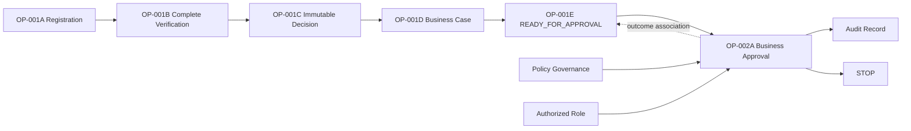

# OP-002A — Business Approval Capability

## Executive Summary

OP-002A implements KDOS's first governed Business Approval capability. It consumes—not replaces—the canonical registration, verification, immutable Decision, Business Case, and `READY_FOR_APPROVAL` Operational Status. It records an authorized `APPROVED` or `REJECTED` outcome, audit evidence, and an Operational Status association, then stops without publication.

## Approval Capability Model

The immutable approval record contains an approval identifier, monotonic version, one of exactly `ELIGIBLE`, `APPROVED`, or `REJECTED`, canonical prerequisite references, responsible role and policy references, correlation identifier, outcome reason reference, and append-only audit records. Only `ELIGIBLE → APPROVED` and `ELIGIBLE → REJECTED` are valid.

## Approval Relationship Diagram

## Validation Report

Eligibility is rejected when the Business Case, registration, matching canonical verification evidence with `COMPLETED` status, Decision, or matching `READY_FOR_APPROVAL` snapshot is absent. It also rejects roles outside the supplied Role Definition authorization, policy references that do not match or permit approval, duplicate approval identifiers, duplicate approvals for one Business Case, and any transition other than the two authorized outcomes.

## Audit Evidence

Eligibility and the terminal outcome each append a frozen audit record with the approval, Business Case, Operational Status, Decision, correlation, policy, role, evidence, action, and timestamp references. The outcome audit reference is associated with the OP-001E snapshot without changing its current status or rewriting its transition history.

## Test Results

Unit tests cover eligible, approved, and rejected cases; missing prerequisites; unauthorized role; policy violation; duplicates; and invalid outcomes. Integration/end-to-end coverage composes OP-001A through OP-002A, verifies audit and Operational Status linkage, and proves that execution terminates without publication.

## Components Reused

- OP-001A registration and OP-001B completed-verification references.
- OP-001C immutable Decision reference.
- OP-001D Business Case identity, ownership, policy, correlation, and references.
- OP-001E `READY_FOR_APPROVAL` snapshot and append-only transition history.
- Policy Governance and Role Definition authorization inputs.

No prerequisite entity or governance framework is duplicated.

## Components Introduced

- Business Approval identity and three-state capability model.
- Eligibility and authorization validation.
- Immutable outcome and audit recording.
- Outcome association update on Operational Status without a new status.

## Known Limitations

- Duplicate detection consumes compiler-provided known identifiers and approved-case references because persistence is forbidden.
- Verification completeness is represented by the canonical completed-verification reference supplied through OP-001D; OP-002A does not reimplement verification.
- Policy permission and authorized roles are resolved by their canonical frameworks and supplied as governed inputs; OP-002A does not define them.
- The Operational Status remains `READY_FOR_APPROVAL` because OP-001E authorized no post-approval status; only the approval outcome association and snapshot version are updated.

## Recommendation for OP-002B

Require a separate Executive Board authorization for OP-002B. It should consume the immutable approval outcome by reference and must not infer publication, public visibility, marketplace, search, notification, workflow, persistence, API, or UI authority from OP-002A.
