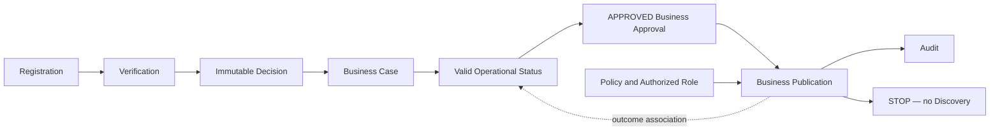

# OP-002B — Business Publication Capability

## Executive Summary

OP-002B implements the canonical governed publication of an approved Business Case. It consumes the immutable OP-002A `APPROVED` record and canonical case/status associations, records `PUBLISHED` or `REJECTED`, associates audit evidence with Operational Status, and stops. It creates no discovery or marketplace behavior.

## Publication Capability Model

The immutable record contains publication identity, monotonic version, exactly one of `ELIGIBLE`, `PUBLISHED`, or `REJECTED`, publication timestamp (only when published), Business Case, Approval, Decision and Operational Status references, governance references, correlation identifier, reason reference, and append-only audit records. Only `ELIGIBLE → PUBLISHED` and `ELIGIBLE → REJECTED` are valid.

## Relationship Diagram

## Validation Report

Publication rejects a missing Approval, any outcome other than `APPROVED`, a missing or mismatched Business Case, an invalid Operational Status or approval association, unauthorized role, non-permitting or mismatched policy, duplicate identifier, duplicate Business Case publication, and invalid requests or outcome transitions.

## Audit Evidence

Eligibility and outcome append frozen audit records containing publication, case, Approval, Operational Status, correlation, policy, role, evidence, action, and timestamp references. A successful publication uses the governed outcome timestamp as `publicationTimestamp`. The outcome audit is associated with OP-001E without rewriting status history.

## Test Results

Unit tests cover successful and rejected publication, timestamp semantics, missing/invalid Approval, duplicates, policy violation, unauthorized role, and invalid transitions. Integration/end-to-end coverage composes OP-001A through OP-002B and proves the flow stops after Publication and Audit without Discovery or Marketplace output.

## Components Reused

- OP-001A registration, OP-001B completed verification, and OP-001C immutable Decision through canonical references.
- OP-001D Business Case identity, policy, role, correlation and associations.
- OP-001E valid snapshot, approval association, and append-only status history.
- OP-002A immutable `APPROVED` outcome and audit evidence.
- Canonical Policy Governance and Role Definition resolution inputs.

No prerequisite logic or entity is reimplemented.

## Components Introduced

- Business Publication identity and three-state model.
- Publication eligibility and governance checks.
- Immutable outcome, publication timestamp, and audit records.
- Publication outcome association on Operational Status without a new status.

## Known Limitations

- Duplicate detection consumes compiler-provided known identifiers and published-case references because persistence is forbidden.
- Policy and role decisions are supplied by their canonical frameworks; OP-002B only validates their resolved references and permission.
- OP-001E has no post-publication status, so the snapshot retains its authorized status while adding a versioned publication association.
- Being `PUBLISHED` makes the record eligible for a separately authorized future public-domain consumer; it does not make it searchable or discoverable.

## Recommendation for OP-002C

Require a separate Executive Board authorization. OP-002C may consume the immutable publication record by reference only within its approved scope; it must not infer search, discovery, ranking, recommendation, marketplace, review, notification, API, UI, persistence, or runtime authority from OP-002B.

