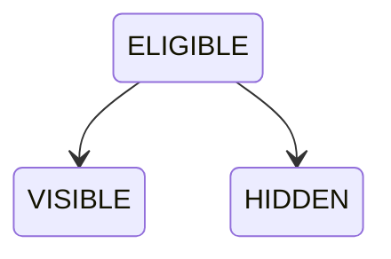
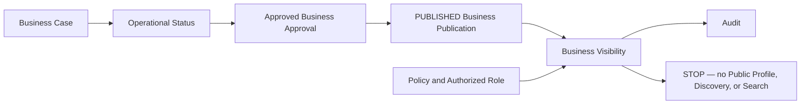

# OP-002C — Business Visibility Capability

## Executive Summary

OP-002C establishes policy-controlled public visibility for a canonically published Business. It determines only whether the Business is `VISIBLE` or `HIDDEN`, records audit evidence, and stops. It defines neither public representation nor how anyone finds the Business.

## Business Visibility Model

The immutable record contains visibility identity, monotonic version, exactly `ELIGIBLE`, `VISIBLE`, or `HIDDEN`, Business Case, Publication, Approval, Decision and Operational Status references, governance references, correlation identifier, outcome reason, and append-only audit records.

## Visibility Lifecycle

There are no other states or transitions.

## Relationship Diagram

## Validation Report

Visibility rejects missing or non-`PUBLISHED` publication, missing or mismatched Business Case, missing or invalid Operational Status/publication association, unauthorized role, non-permitting or mismatched policy, duplicate identifier, duplicate Business Case visibility, malformed requests, and transitions outside `ELIGIBLE → VISIBLE|HIDDEN`.

## Audit Evidence

Eligibility and outcome append frozen audit records containing visibility, Business Case, Publication, Operational Status, correlation, policy, role, evidence, action, and timestamp references. The outcome audit is associated with OP-001E without modifying its transition history or introducing a visibility status there.

## Test Results

Unit tests cover successful visibility, hidden outcome, missing and invalid publication, missing status, duplicates, unauthorized role, policy violation, and invalid transitions. Integration/end-to-end coverage composes OP-001A through OP-002C and proves execution stops after Visibility and Audit without Public Profile, Discovery, or Search output.

## Components Reused

- OP-001A through OP-001C canonical references.
- OP-001D Business Case identity, governance, correlation and associations.
- OP-001E valid snapshot, publication association, and append-only status history.
- OP-002A immutable approved outcome through OP-002B.
- OP-002B immutable `PUBLISHED` record and timestamp.
- Canonical Policy Governance and Role Definition resolution inputs.

No prerequisite model or logic is duplicated.

## Components Introduced

- Business Visibility identity and three-state capability model.
- Visibility eligibility and governance validation.
- Immutable visibility outcome and audit evidence.
- Visibility association on Operational Status without a new operational state.

## Known Limitations

- Duplicate detection consumes compiler-provided known identifiers and visible-case references because persistence is forbidden.
- Policy and role decisions are resolved externally by their canonical frameworks and supplied as governed inputs.
- `VISIBLE` communicates policy eligibility only; it contains no public fields, representation, profile, rendering, indexing, discovery, or search behavior.
- OP-001E retains its authorized status and receives only a versioned visibility association.

## Recommendation for OP-002D

Require separate Executive Board authorization. OP-002D may consume the immutable visibility outcome by reference only within its approved scope. It must not infer Public Business Profile, public fields, discovery, search, ranking, recommendation, marketplace, review, notification, persistence, endpoint, UI, or runtime authority from OP-002C.

