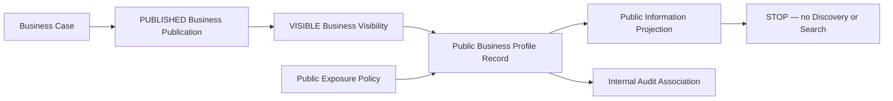

# OP-002D — Public Business Profile Capability

## Executive Summary

OP-002D establishes the official, policy-governed public representation of an OP-002C `VISIBLE` Business. It exposes only the approved information allowlist, retains internal lineage and audit association outside the public projection, and stops without Discovery or Search.

## Public Business Profile Model

The governed record has identity and version, public information, canonical Business Case/Publication/Visibility associations, governing policy reference, creation timestamp, and audit association. Its public projection contains only business name, category reference, description, public contact methods, location reference, operating hours, verification badge reference, and public metadata.

## Relationship Diagram

## Validation Report

Creation rejects missing or non-`VISIBLE` visibility, missing or non-`PUBLISHED` publication, missing or mismatched Business Case associations, unauthorized visibility lineage, duplicate identifier, duplicate Business Case profile, policy refusal/mismatch, malformed required public fields, unknown top-level public fields, and forbidden internal fields at any nested depth.

## Audit Evidence

The internal audit association records the canonical action, audit and evidence references, timestamp, and correlation identifier. It is deliberately omitted from the public projection together with all case, publication, visibility, governance, Decision, and operational associations.

## Test Results

Unit tests cover valid profile/projection, invalid visibility, missing publication, missing Business Case, duplicates, policy violation, and top-level/nested internal-field exposure. Integration/end-to-end coverage composes OP-001A through OP-002D, verifies public audit association, and proves termination without Discovery, Search, or Ranking output.

## Components Reused

- OP-001A through OP-001C canonical lineage references.
- OP-001D Business Case identity, policy and correlation.
- OP-001E operational lineage through OP-002C.
- OP-002A approved and OP-002B published lineage through canonical records.
- OP-002C immutable `VISIBLE` outcome and governing policy.

No Business Case, Publication, Visibility, contact, location, trust, or audit owner is duplicated; public values are representations or references only.

## Components Introduced

- Public Business Profile identity and governed record.
- Explicit public-information allowlist and safe projection.
- Public contact representation and operating-hours representation.
- Verification badge and location references.
- Internal audit association separated from public output.

## Known Limitations

- Duplicate detection consumes compiler-provided known identifiers and profiled-case references because persistence is forbidden.
- Public contact, location, category, verification badge, and operating-hours values are supplied as canonical references/representations; OP-002D does not own their source models.
- Public metadata is policy-filtered structurally but contains no rendering, indexing, or discovery semantics.
- The capability performs no revocation or update lifecycle because none was authorized.

## Recommendation for OP-002E

Require separate Executive Board authorization. OP-002E may consume the safe public projection only for its expressly approved purpose. It must not infer Discovery, Search, ranking, recommendation, review, marketplace listing, messaging, booking, payment, notification, API, UI, persistence, or runtime authority from OP-002D.

