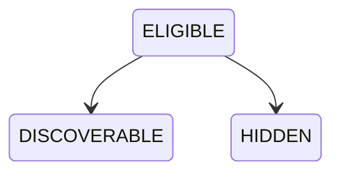

# OP-002E — Public Discovery Capability

## Executive Summary

OP-002E enables a governed OP-002D Public Business Profile backed by `VISIBLE` and `PUBLISHED` records to become `DISCOVERABLE` or remain `HIDDEN`. It reuses the safe profile projection, records audit evidence, and stops without Search, filtering, ranking, or recommendations.

## Discovery Model

The immutable record contains discovery identity and version, exactly `ELIGIBLE`, `DISCOVERABLE`, or `HIDDEN`, Public Profile/Visibility/Publication associations, governing policy reference, the safe OP-002D projection, outcome reason, and append-only audit records. A public listing exists only for `DISCOVERABLE`.

## Discovery Lifecycle

## Relationship Diagram

## Validation Report

Discovery rejects missing Public Profile or Visibility, non-`VISIBLE` visibility, absent/non-`PUBLISHED` publication, mismatched Profile/Visibility/Publication lineage, duplicate identifier, duplicate profile discovery, policy refusal/mismatch, malformed requests, and transitions outside `ELIGIBLE → DISCOVERABLE|HIDDEN`.

## Audit Evidence

Eligibility and outcome append frozen audit records containing discovery, Public Profile, Visibility, Publication, policy, evidence, action, and timestamp references. Audit and governance associations are never included in the controlled listing projection.

## Test Results

Unit tests cover discoverable/hidden outcomes and projection behavior, missing/invalid prerequisites, duplicates, unauthorized exposure, policy violation, and invalid transitions. Integration/end-to-end coverage composes OP-001A through OP-002E and proves termination after Discovery and Audit without Search, Ranking, or Filters.

## Components Reused

- OP-001A through OP-001C canonical lineage.
- OP-001D and OP-001E lineage through the governed capability chain.
- OP-002A approval, OP-002B `PUBLISHED`, and OP-002C `VISIBLE` records.
- OP-002D governed profile and safe public projection.
- Canonical Policy Governance resolution input.

No prerequisite model, public information, or projection rule is duplicated.

## Components Introduced

- Public Discovery identity and three-state model.
- Discovery eligibility, lineage, duplicate, and policy validation.
- Controlled listing projection for `DISCOVERABLE` only.
- Immutable discovery audit evidence.

## Known Limitations

- Duplicate detection consumes compiler-provided known identifiers and discovered-profile references because persistence is forbidden.
- The listing is a deterministic projection of one supplied profile; no collection query, index, filter, ordering, or pagination exists.
- `DISCOVERABLE` establishes listing eligibility only and is not searchable.
- Policy decisions are resolved by the canonical framework and supplied as governed input.

## Recommendation for OP-002F

Require separate Executive Board authorization. OP-002F may consume only the controlled listing projection for its expressly approved purpose. It must not infer Search, filtering, ranking, recommendation, maps, reviews, messaging, booking, payment, notification, API, UI, persistence, indexing, or runtime authority from OP-002E.

