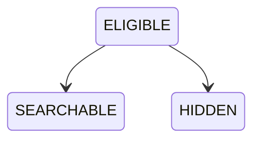

# OP-002F — Business Search Capability

## Executive Summary

OP-002F establishes the canonical governed gateway for finding businesses. It searches only an OP-002E `DISCOVERABLE` Business backed by a canonical Public Profile, `VISIBLE` Visibility, and `PUBLISHED` Publication. Results contain only the OP-002D public projection, and execution stops without Ranking or Recommendations.

## Business Search Model

The immutable Search record contains identity/version, exactly `ELIGIBLE`, `SEARCHABLE`, or `HIDDEN`, Discovery and Public Profile references, governing policy, safe result projection, reason, and append-only audit records. The query contains identifier, bounded text term, normalized term, and timestamp. Results are zero or one canonical profile projection in this persistence-free capability boundary.

## Search Lifecycle

## Relationship Diagram

## Validation Report

Search rejects missing/non-`DISCOVERABLE` Discovery, missing Public Profile, non-`VISIBLE` Visibility, non-`PUBLISHED` Publication, mismatched canonical lineage, duplicate identifier/profile record, policy refusal/mismatch, empty or oversized queries, and transitions outside `ELIGIBLE → SEARCHABLE|HIDDEN`.

## Audit Evidence

Eligibility and outcome append frozen audit records with Search, Discovery, Public Profile, policy, evidence, action, and timestamp references. Search results contain none of these audit/governance/association records and expose only the canonical public profile projection.

## Test Results

Unit tests cover successful and unmatched Search, hidden rejection, result exposure, missing prerequisites, invalid Visibility/Publication, policy violation, duplicates, and query/transition behavior. Integration/end-to-end coverage composes OP-001A through OP-002F and proves termination after Search and Audit without Ranking, Recommendations, or Marketplace output.

## Components Reused

- OP-001A through OP-001E canonical operational lineage.
- OP-002A Approval, OP-002B `PUBLISHED`, and OP-002C `VISIBLE` records.
- OP-002D governed Public Business Profile and safe projection.
- OP-002E `DISCOVERABLE` record and governance lineage.

No publication, visibility, discovery, or public projection rule is duplicated.

## Components Introduced

- Business Search identity and three-state model.
- Bounded Search query model and deterministic term matching.
- Search eligibility, lineage, duplicate, and policy validation.
- Safe Search result envelope and immutable audit evidence.

## Performance Architecture Report

The query, eligibility record, and result contracts are independent from candidate retrieval. OP-002F evaluates one canonical candidate supplied at its boundary; a future authorized provider can replace candidate retrieval with a scalable implementation while preserving all domain contracts and governance checks. No cache, index, optimizer, ranking, ordering, pagination, or external engine is included.

## Known Limitations

- Persistence is forbidden, so duplicate context and the single canonical candidate are supplied by the compiler/caller.
- Matching is normalized, case-insensitive substring comparison over approved name, category, description, and location fields only.
- Results are neither ranked nor personalized and preserve input/candidate order by design.
- No collection retrieval, index, cache, pagination, typo tolerance, language stemming, or performance optimization is implemented.

## Recommendation for OP-003A

Require separate Executive Board authorization. OP-003A may consume the canonical Search result projection only within its expressly approved scope. It must not infer Ranking, Recommendations, personalization, ML/AI, maps, reviews, marketplace, messaging, booking, payment, notification, API, UI, persistence, caching, indexing, or runtime authority from OP-002F.

