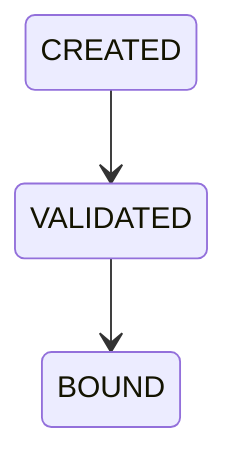

# OP-003B — Canonical Operational Adapters Foundation

## Executive Summary

OP-003B introduces validation-only adapter boundaries for canonical OP-001A Registration, OP-001B Verification, and immutable OP-001C Decision references. A Business Request now produces a validated, bound operational context consumed unchanged by OP-001D and OP-002A. No business rule, governance resolver, downstream capability, API, UI, persistence, or runtime engine is introduced.

## Canonical Adapter Model

Each immutable adapter contains identity, type (`OP-001A`, `OP-001B`, or `OP-001C`), version, lifecycle state, Business Request reference, case/correlation/policy references, canonical output reference, predecessor adapter reference, and append-only audit-linked history. The combined context exposes only the existing Registration, Verification, Decision, and completed-verification evidence input contracts.

## Adapter Lifecycle

## Dependency Diagram

## Integration Report

The adapter context supplies the exact objects already accepted by Business Case and Approval boundaries. The OP-003B end-to-end test injects this context into the unchanged OP-003A validation fixture and reaches the same `READY_FOR_APPROVAL`, `APPROVED`, `PUBLISHED`, `VISIBLE`, `DISCOVERABLE`, and `SEARCHABLE` outcomes and Arabic-first Search projection.

## Validation Report

Validation rejects unknown adapter types, missing identity/context fields, duplicate adapter identifiers, duplicate type/output bindings, missing predecessors, unbound predecessors, incorrect predecessor types, changed Business Request/case/correlation/policy lineage, incomplete adapter sets, and incompatible lifecycle state.

## Audit Report

Every adapter appends frozen `CREATED`, `VALIDATED`, and `BOUND` history entries with sequence, prior/current state, adapter and Business Request identifiers, correlation identifier, timestamp, and external audit reference. Adapters associate audit evidence; they do not replace the canonical audit owner.

## Test Results

Unit tests cover creation, lifecycle, immutability, invalid data, missing/duplicate adapters, and invalid linkage. Integration tests verify the canonical context shapes. End-to-end coverage executes that context through OP-001D to OP-002F. Existing OP-003A and capability regression suites remain unchanged and pass through the root runner.

## Components Reused

- Canonical OP-001A/B/C output reference contracts already consumed by OP-001D.
- OP-001D Business Case and OP-002A completed-verification input shapes.
- OP-001E and OP-002A through OP-002F unchanged application boundaries.
- OP-003A complete-chain validation fixture.

No business, governance, audit-owner, or projection rule is duplicated.

## Components Introduced

- Canonical adapter identity/type/lifecycle contract.
- Registration, Verification, and Decision adapter execution boundaries.
- Canonical operational context binding and validation.
- Adapter audit association history.

## Known Limitations

- Adapters bind authoritative references supplied by an external source; they do not execute Registration, Verification, or Decision business rules.
- Policy and Role resolvers remain explicitly out of scope, so policy references are bound but permission decisions remain caller-resolved downstream.
- Duplicate context is caller/compiler supplied because persistence is forbidden.
- No source transport, signature validation, transaction, recovery, concurrency, API, database, or runtime orchestration is implemented.

## Executive Recommendation for OP-003C

Proceed to the next Alpha Readiness work package for authoritative governance resolution only if separately authorized. Preserve these adapter contracts and rerun OP-003A/OP-003B validation across any future source adapter. Do not infer new capability, resolver, persistence, API, UI, or runtime authority from OP-003B.

