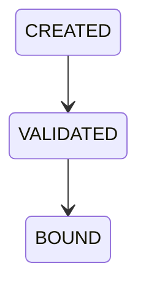

# OP-003C — Authoritative Policy & Role Resolution Foundation

## Executive Summary

OP-003C establishes canonical resolution boundaries for authoritative Policy and Role outputs. Resolved governance is bound to OP-003B Business Request, case, Decision, Operational Status, and correlation lineage and supplies all existing capability governance inputs without changing their behavior. No new capability or business state is introduced.

## Policy Resolver Model

The Policy resolution records identity, authoritative source/reference, version/state, Business Request/case/Decision/Operational Status/correlation lineage, canonical policy reference, the six existing capability permissions, and append-only audit-linked history. Only `CANONICAL_POLICY_AUTHORITY` is accepted.

## Role Resolver Model

The Role resolution uses the same lineage and history contract and contains the authoritative responsible role and authorized-role set. The responsible role must be present in that authoritative set. Only `CANONICAL_ROLE_AUTHORITY` is accepted.

## Governance Resolution Lifecycle

## Dependency Diagram

## Validation Report

Resolution rejects missing Policy, missing Role, non-authoritative source types, invalid permissions/role membership, duplicate resolution identifiers/request bindings, unbound outputs, missing OP-003B context, and any mismatch in Business Request, case, Decision, Operational Status, correlation, or policy lineage.

## Audit Report

Policy and Role resolutions append frozen `CREATED`, `VALIDATED`, and `BOUND` entries containing sequence, previous/current state, resolution/type, Business Request, correlation, timestamp, and audit reference. The resolver associates evidence and does not replace the canonical Audit owner.

## Test Results

Unit tests validate Policy/Role resolution, immutability, missing/invalid outputs, non-authoritative sources, and duplicates. Integration tests bind OP-003B adapters to governance and reject discontinuity. End-to-end coverage drives the unchanged OP-001D through OP-002F lifecycle using only the resolved governance context. Root regression includes OP-001D through OP-003B unchanged.

## Components Reused

- OP-003B Business Request and canonical adapter lineage.
- OP-001D case/Decision/correlation input contracts.
- Existing OP-001E and OP-002A through OP-002F governance input shapes.
- OP-003A complete-chain validation fixture.

No capability, projection, Policy business rule, Role business rule, or downstream validation is duplicated.

## Components Introduced

- Canonical Policy and Role resolver contracts.
- Authoritative source validation.
- Six-permission canonical governance binding.
- Cross-resolver and adapter lineage validation.
- Resolver audit association lifecycle.

## Known Limitations

- Authority records are supplied to the resolver boundary because transport and persistence are forbidden; source authentication/signatures are not implemented.
- The canonical permission set maps only the already-existing capabilities and introduces no policy semantics.
- Operational capabilities retain their defensive local validation, but the integration path supplies values exclusively from the bound governance context.
- No policy authoring, role administration, revocation, hierarchy, database, transaction, API, UI, or runtime engine exists.

## Alpha Readiness Recommendation

The authoritative governance boundary closes the caller-supplied governance gap for the validated Alpha integration path. Recommend **READY FOR ALPHA CERTIFICATION VALIDATION**, subject to rerunning OP-003A, OP-003B, and OP-003C against the eventual authenticated authority transport. Do not infer production, persistence, API, UI, runtime, or new-capability readiness.

