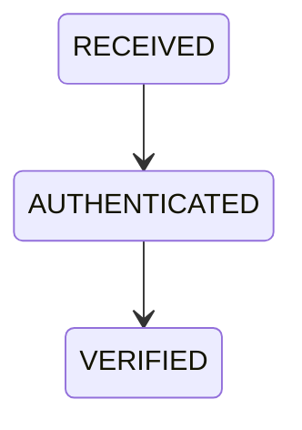
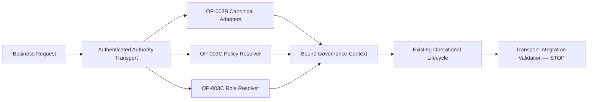

# OP-004A — Authenticated Authority Transport Foundation

## Executive Summary

OP-004A establishes authenticated transport trust before OP-003C governance resolution. Signed Policy and Role envelopes are identified against a trusted authority registry, verified for Ed25519 integrity, freshness, and correlation, and only then translated into resolver inputs. The existing business lifecycle is unchanged.

## Authority Transport Model

The immutable envelope contains envelope and Authority identifiers, source, timestamp, Authority version, correlation identifier, integrity algorithm/signature, governance payload, transport version/state, and append-only audit-linked history. The signature covers all Authority headers and the recursively canonicalized payload.

## Transport Lifecycle

## Dependency Diagram

## Validation Report

Transport rejects missing Authority identity, unknown/unregistered sources, identity mismatch against the trusted registry, unsupported algorithms, invalid Ed25519 signatures, duplicate envelope identifiers, correlation mismatch, future timestamps, expired envelopes, and invalid lifecycle operations. OP-003C accepts only `VERIFIED` envelopes of the correct Policy/Role source with matching correlation.

## Audit Report

Each envelope appends frozen `RECEIVED`, `AUTHENTICATED`, and `VERIFIED` entries containing sequence, previous/current state, envelope/Authority identifiers, correlation, timestamp, and audit reference. Transport associates audit evidence and does not replace the canonical Audit owner.

## Test Results

Unit tests generate ephemeral Ed25519 keys and cover valid authority, missing/invalid identity, unknown source, invalid integrity, duplicates, correlation, and expiry. Integration/end-to-end coverage enforces transport before OP-003C and executes OP-001D through OP-002F unchanged. The root regression runner covers all earlier foundations and capabilities.

## Components Reused

- OP-003B canonical Business Request, adapter, case, Decision, correlation, and policy lineage.
- OP-003C Policy/Role resolver contracts and governance binder.
- OP-003A unchanged lifecycle fixture and OP-001D through OP-002F boundaries.

No adapter, governance, capability, or public projection rule is duplicated.

## Components Introduced

- Signed Authority envelope and stable canonical signing payload.
- Trusted Authority identity/source registry boundary.
- Ed25519 origin/integrity verification.
- Timestamp freshness, correlation, duplicate, and lifecycle validation.
- Verified-envelope-to-OP-003C transport boundary.

## Known Limitations

- Trusted public keys are supplied in-process because persistence, deployment infrastructure, certificate management, and remote key discovery are forbidden.
- Key rotation, revocation, certificate chains, hardware-backed keys, replay persistence, and clock synchronization are not implemented.
- Duplicate detection is caller/compiler supplied and cannot prevent replay across processes without a future authorized durable store.
- Transport authentication applies to governance Authority envelopes only; it is not user authentication, login, OAuth, JWT, or session management.

## Recommendation for the Next Alpha Certification Work Package

Recommend **READY FOR NEXT ALPHA CERTIFICATION WORK PACKAGE** for the validated in-process transport boundary. A later authorized package should validate replay protection and trusted-key lifecycle without altering these envelope/resolver contracts. Do not infer API, persistence, infrastructure, runtime, user-authentication, or new-capability readiness.

